[TOC]
# gui
## utility
### update 12-18-2020
#### panel
- scene-build-panel
    - summary
        ```
        更新：
            Common
                现在支持“CFX”和“EFX”的数据预览了；
                现在支持Linux-shell和Maya的预览了；
                现在在没有打开镜头的状态下会显示所有的镜头,可以选中要预览的镜头的复选框，然后点击“Load”预览（图1，2）；
                如果是打开镜头文件的状态下只会显示当前镜头的数据（图3）。
            Houdini
                现在支持“CFX”和“EFX”的Build。
        BUG修复：
            Houdini
                Material和Houdini-shader的错误。
        Build操作：
            Houdini
                自动连接 Indirect-input（图4）；
                会根据资产的“role”创建sub-network，群集会被重新分配给“crd”。
        Validation：
            Houdini:
                排除了Xgen-path检查
        ```
        - 1 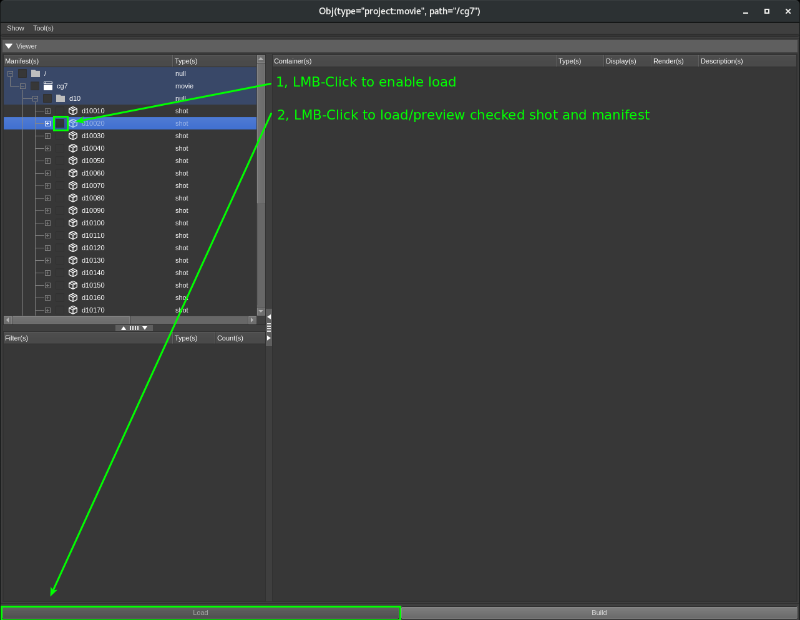
        - 2 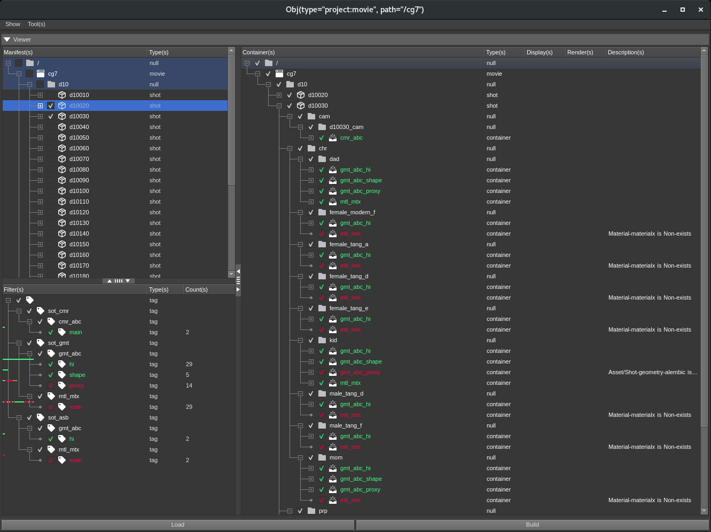
        - 3 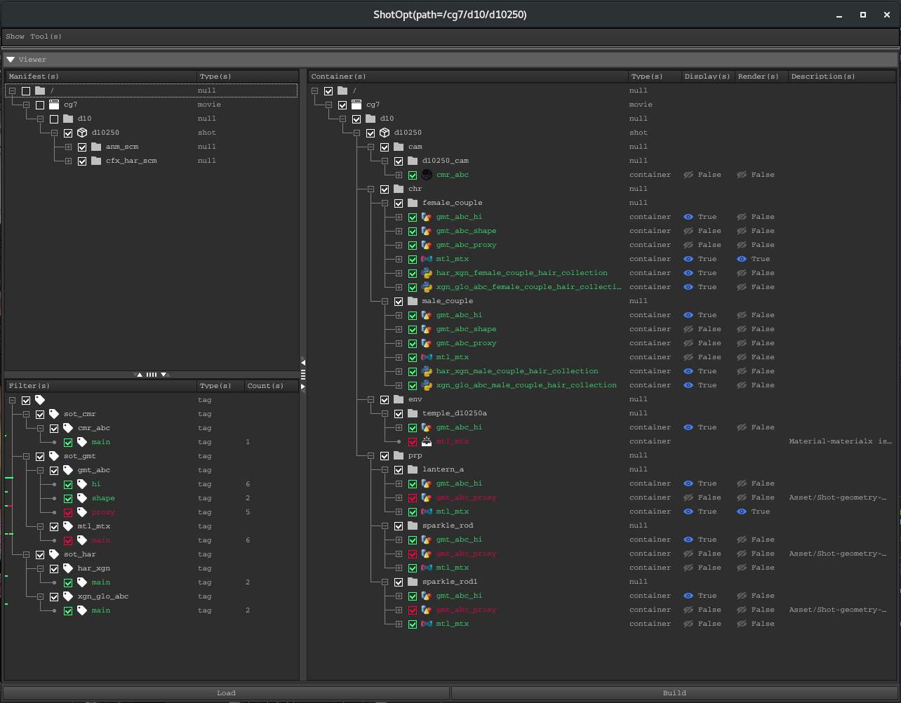
        - 4 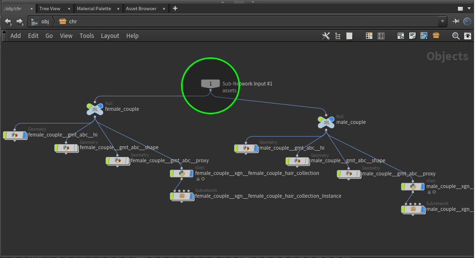
        - 5 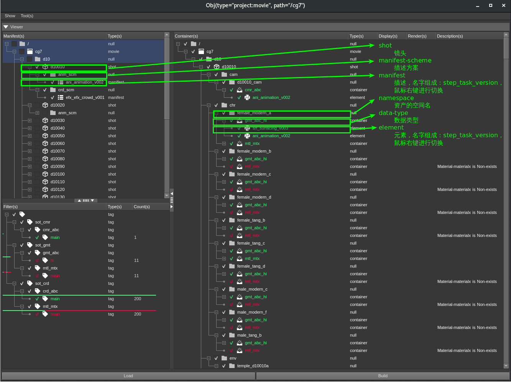
    - platform
        - linux
            - add
                ```
                增加了脱离DCC的启动方式，暂时没有Build功能，只能预览
                ```
                - setup
                    ```shell
                    通过Shell命令启动
                    rez-env lxdcc -c lynxi
                    ```
    - application
        - maya
            - add
                ```
                增加了Maya的启动方式，暂时没有Build功能，只能预览
                ```
                - setup
                    ```
                    通过菜单栏启动
                    Maya-menu > Td-tool(s) > Scene-build
                    ```
            
    - build-scheme
        - add
            ```
            新增的Build方案
            manifest-scheme
                cfx_scm: character-effect-scheme (角色特效方案)
                efx_scm: effect-scheme (特效方案)
            container-scheme
                sot_har: shot-hair (镜头毛发)
                sot_efx: shot-effect (镜头特效)
            container-data-type
                har_xgn: hair-xgen (毛发Xgen)
                xgn_glo_abc: xgen-glow-alembic-cache (Xgen生长面Aleambic)
            ```
    - tool
        - update
            - guess
                ```
                按钮移动到了菜单栏
                Lynxi-menu > Tool(s) > Guess
                ```
### update 12-09-2020
#### panel
- scene-build-panel
    - build-scheme
        - add:
            ```
            manifest-scheme
                anm_scm: animation-scheme (动画方案)
                crd_scm: crowd-scheme (群集方案)
            container-scheme
                sot_cmr: shot-camera (镜头相机)
                sot_anm: shot-geometry (镜头几何形状)
                sot_asb: shot-assembly (镜头组装)
                sot_crd: shot-crowd (镜头群集)
            container-data-type
                cmr_abc: camera-alembic-cache (相机Aleambic)
                gmt_abc: geometry-alembic-cache (几何形状Aleambic)
                crd_abc: crowd-alembic-cache (群集Aleambic)
                mtl_mtx: material-materialx (材质Materialx)
            ```
    - viewer
        - add
            - 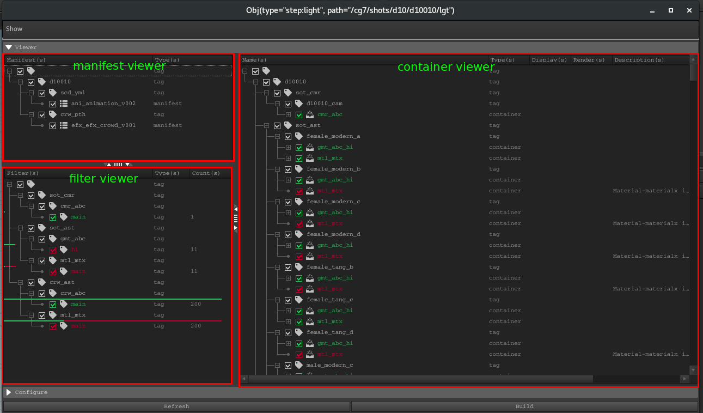
            - manifest-viewer
                - add version-switch
                    - mouse-right click a action and click press button "Preview" to load
                - rules:
                    - list check-box is checked
            - filter-viewer
                - rules:
                    - filter by check-box click
        - update
            - container-viewer
                - add validation-state
                    - 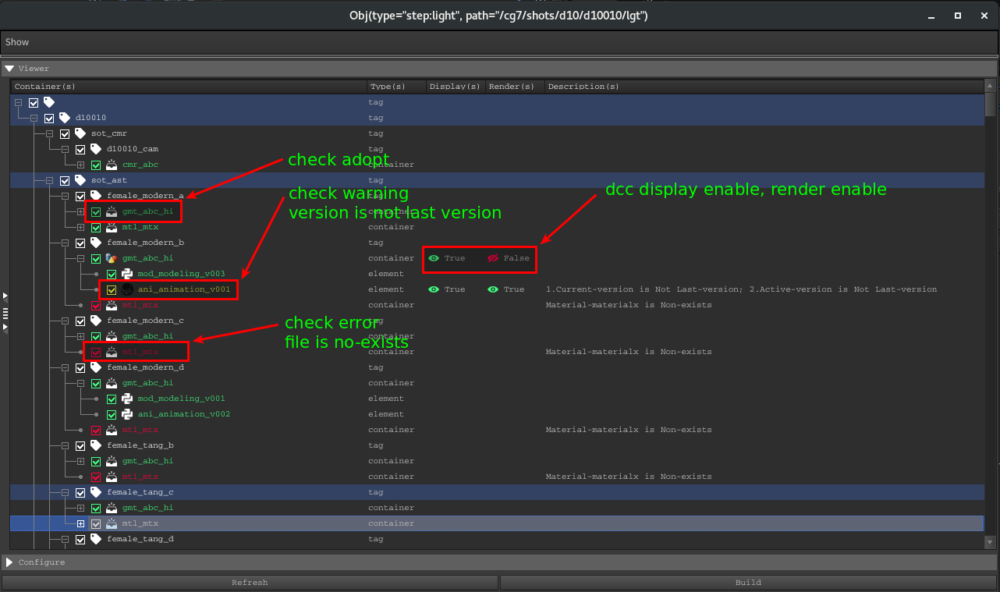
                - group by scheme
                    - 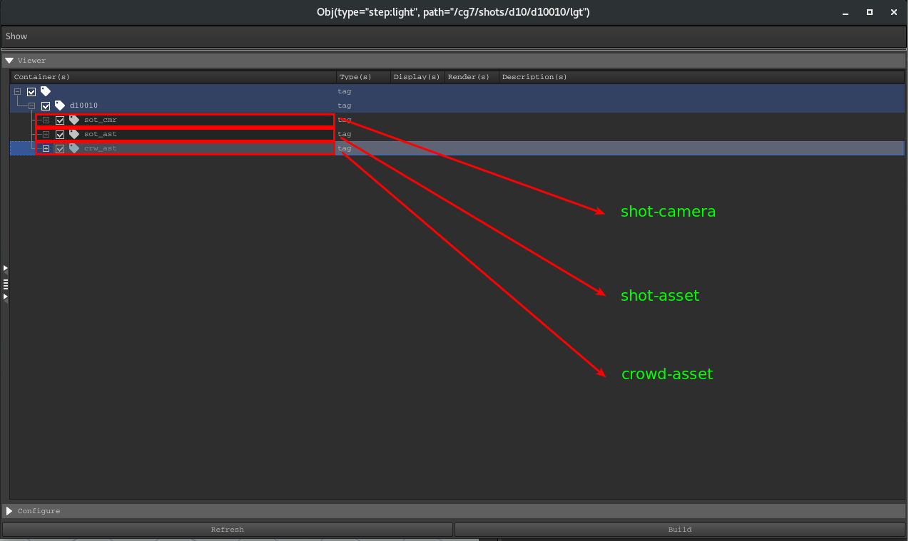
                - remove key-press action "Space" to click check-box
#### proxy
- widget
    - add 
        - splitter
            - 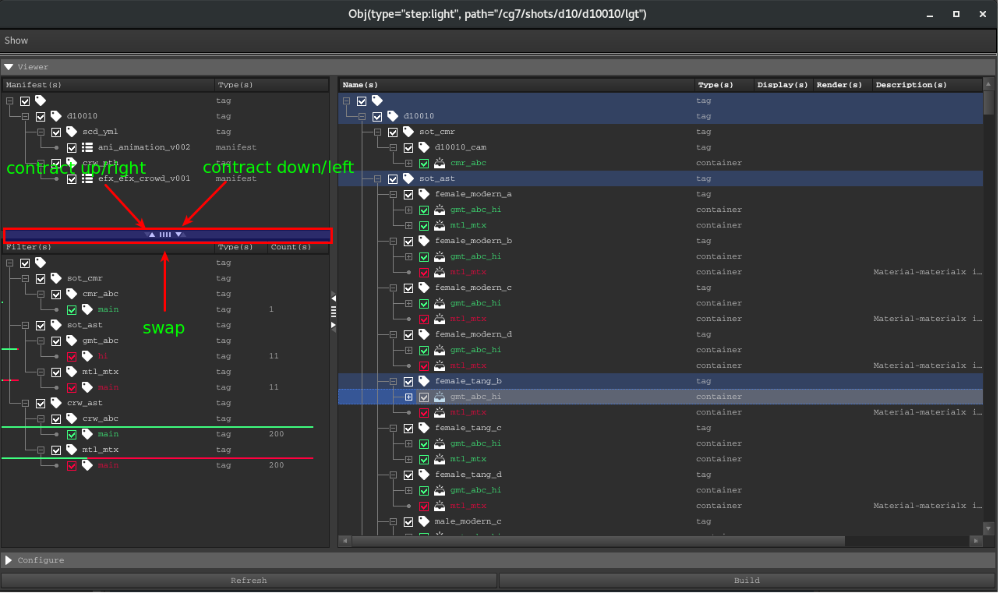
    - update
        - tree-item
            - add validation-statistics-state
                - 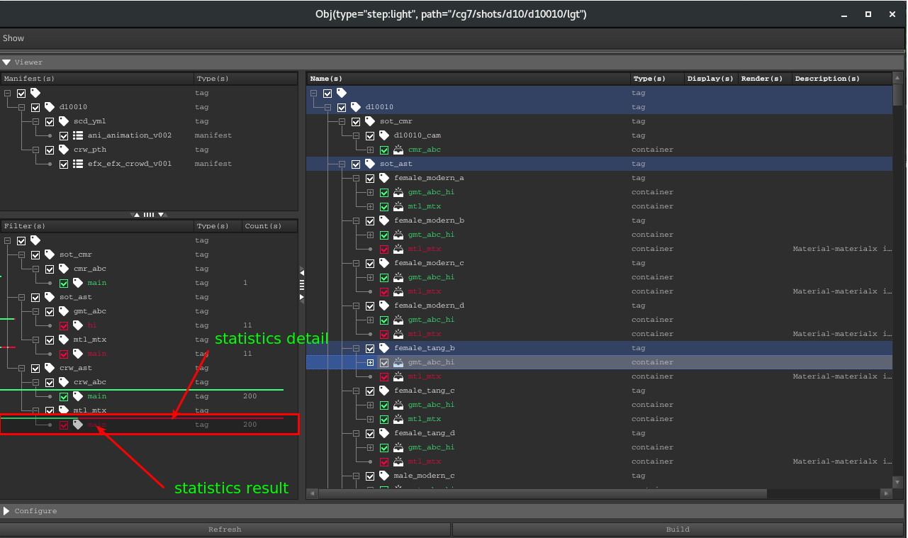
        - tree-view：
            - add selected, indirect-selected state
                - 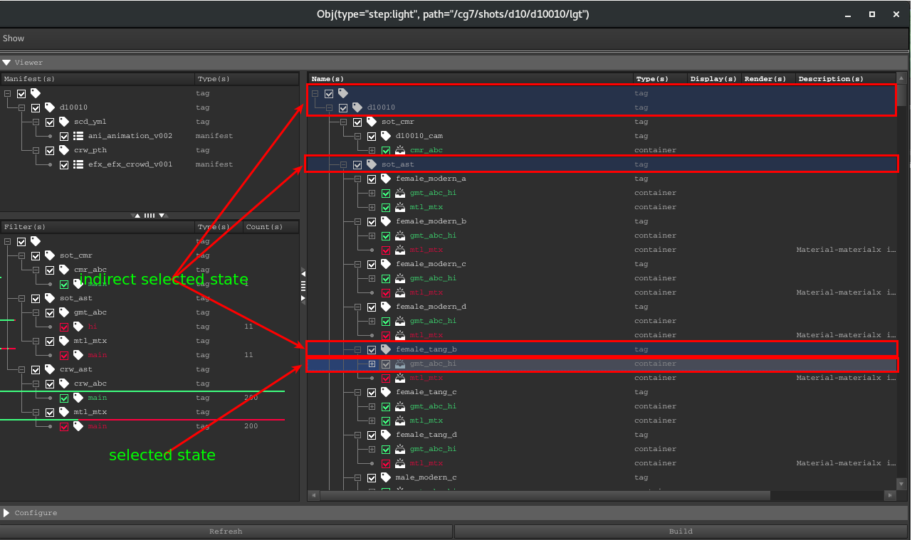